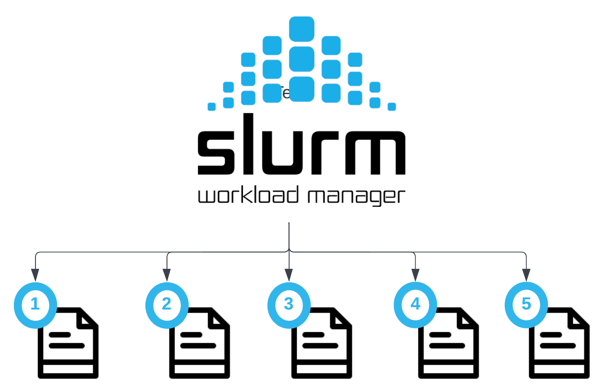

# Demo on deploying Nextflow and Slurm array on NeSI Mahuika cluster

!!! question "Nextflow"
    

    
{width="200"}

     
    [Nextflow](https://www.nextflow.io/) is workflow management software which enables the writing of scalable and reproducible scientific workflows. It can integrate various software package and environment management systems from environment modules to Docker, Singularity, and Conda. It allows for existing pipelines written in common scripting languages, such as R and Python, to be seamlessly coupled together. It implements a Domain Specific Language (DSL) that simplifies the implementation and running of workflows on cloud or high-performance computing (HPC) infrastructures.
    
    [Nextflow example](./1_nf.md){ .md-button .md-button--primary }    
    
!!! circle-question "Slurm array"
    
    
{width="250"}

     
    Job arrays offer a mechanism for submitting and managing collections of similar jobs quickly and easily; job arrays with millions of tasks can be submitted in milliseconds (subject to configured size limits). All jobs must have the same initial options (e.g. size, time limit, etc.)

    [Slurm Array example using BLAST](./2_blast.md){ .md-button .md-button--primary }